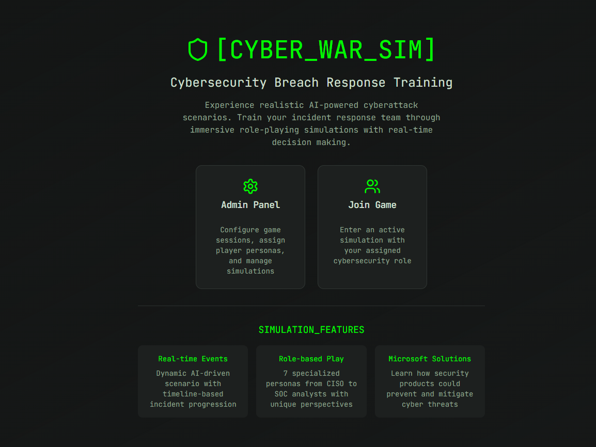
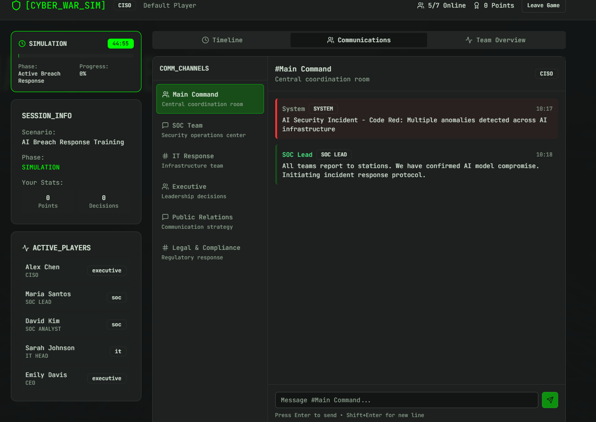

# 🛡️ ZeroDay-Arcade

*AI vs AI Cybersecurity Wargaming PlatformWhere artificial intelligence meets digital warfare*
 

---

## 🚨 **The AI Gold Rush Dilemma**

```diff
+ AI adoption: ↗️ 300% year-over-year growth
- Security understanding: ↘️ Dangerously lagging behind
```

The enterprise world is experiencing an **AI adoption frenzy** unlike anything we've seen before. Organizations are deploying artificial intelligence at *lightning speed*, chasing competitive advantages while walking blindfolded through a minefield of cybersecurity risks. 

> 💡 **Reality Check**: Every AI system deployed without proper security consideration becomes a potential attack vector.

---

## ⚔️ **Project Genesis**

This AI-powered cybersecurity wargaming platform creates realistic simulation environments where AI agents engage as both attackers and defenders in dynamic cyber warfare scenarios. AI red teams execute sophisticated, evolving attack strategies while AI blue teams deploy adaptive defensive countermeasures, generating continuous learning experiences for security professionals and AI systems alike.

---

## 🎯 **The Microsoft Security Value Engine**


<table>
<tr>
<td>

### 📊 **Real-Time Intelligence**
- Mapping of AI threats → MS Security products
- Learning & Development of the AI Workforce
- Performance benchmarking

</td>
<td>

### 💼 **Customer Impact**
- Evidence-based security investments  
- Future-proof protection strategies
- Measurable threat mitigation

</td>
</tr>
</table>

---

<div align="center">

**🔮 Prepare for tomorrow's threats today**

*Because when AI attacks AI, only the smartest defenses survive*

</div>

---


# Screenshots from the idea





